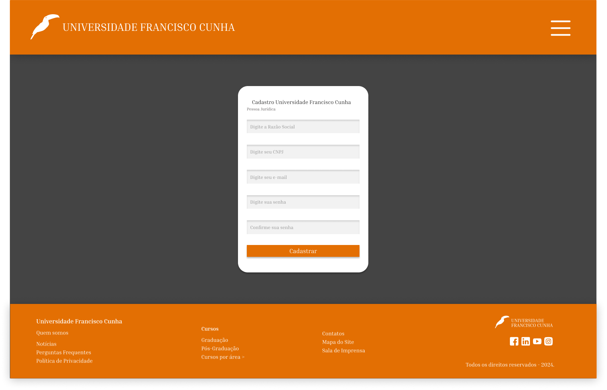
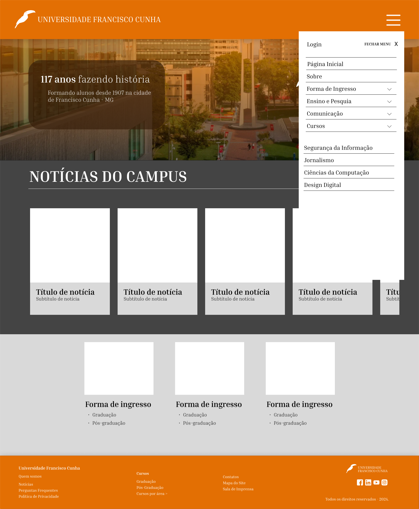

# Projeto Integrador SENAC

Atividade de criação da Interface Gráfica para a aplicação de cadastro de usuários

1. Objetivo do Projeto

  Criar uma interface que permita o cadastro de dois tipos de usuários:  
  + Pessoa Física: Alunos, professores e funcionários da universidade.
  + Pessoa Jurídica: Empresas ou outras instituições que possam se cadastrar para parcerias, eventos ou cursos oferecidos pela universidade.
  
2. Funcionalidades Principais

O site terá uma interface para capturar os dados essenciais de cada tipo de usuário (Pessoa Física e Pessoa Jurídica), com telas diferenciadas para cada um, permitindo que o sistema trate de maneira adequada as informações de cada tipo de cadastro.

3. Estrutura de Cadastro - Pessoa Física

A tela de cadastro da Pessoa Física incluirá os campos conforme abaixo:  
  - Nome completo
  - CPF
  - E-mail
  - Senha (para acesso ao portal da universidade, caso necessário)
  
  
  
    
4. Estrutura de Cadastro - Pessoa Jurídica

A tela de cadastro da Pessoa Jurídica será diferente, pois inclui dados de empresas ou outras instituições. Os campos necessários seriam:  
- Razão Social
- CNPJ
- E-mail de contato
- Senha (para acesso a informações relacionadas à empresa ou instituição)

  
  
5. Validação dos Campos

Todos os campos obrigatórios, como CPF, CNPJ, E-mail e Senha, precisam ser validados.
O sistema deve verificar se o CPF e o CNPJ são válidos e se o e-mail está no formato correto.
A senha deve ter um mínimo de caracteres (por exemplo, 8 caracteres).
Mensagens de erro devem ser exibidas caso o usuário tente enviar o formulário com informações faltantes ou incorretas.

6. Design e Estilo

A interface será limpa e intuitiva, com:
Layout Responsivo: O design será adaptável para diferentes dispositivos (computadores, tablets, smartphones).  
Cores Institucionais: A paleta de cores usará as cores da universidade para manter a identidade visual. Para este exercício, criamos uma universidade fictícia com as cores preto e laranja.  
Campos de entrada: Todos os campos terão bordas destacadas e legendas explicativas para facilitar o preenchimento.  

7. Fluxo de Ações Pós-Cadastro

Confirmação de Cadastro: Após o preenchimento e envio bem-sucedido do formulário, o sistema pode redirecionar para uma página de confirmação, exibindo a mensagem "Cadastro realizado com sucesso!".  
E-mail de Confirmação: O sistema enviará um e-mail de confirmação para o endereço cadastrado, com as informações do usuário e um link para confirmação, caso seja necessário.  

8. Segurança
Criptografia de Senha: A senha cadastrada será criptografada para garantir a segurança dos dados.  
Autenticação: Para acessos posteriores, será necessário que o usuário faça login utilizando o e-mail e senha cadastrados.  

9. Tecnologias Sugeridas

- Frontend: HTML, CSS, JavaScript (com bibliotecas como React ou Vue.js para interação mais dinâmica).
- Backend: Java. 
- Banco de Dados: MySQL ou PostgreSQL para armazenar as informações dos cadastros.
- Validação de CPF/CNPJ: Utilização de APIs ou funções para validar CPF e CNPJ.

10. Possíveis Expansões Futuras

Integração com Sistemas Acadêmicos: Para que alunos e professores possam fazer o login no sistema acadêmico da universidade.  
Área Restrita: Uma área privada para Pessoa Física e Jurídica acessarem informações sobre cursos, eventos ou oportunidades relacionadas.  
Gestão de Cadastro: Uma interface administrativa onde os responsáveis pela universidade possam gerenciar os cadastros de pessoas físicas e jurídicas.  
Esse projeto busca ser simples, intuitivo e funcional, permitindo à Universidade Francisco Cunha cadastrar tanto indivíduos quanto instituições de forma eficiente.  

# Interface

[Acesse a Interface no FIGMA](https://www.figma.com/design/Y19ydHdo4qDxoErMiXxPxT/Projeto-Integrador?node-id=9-138&t=Z7MtAqhue5j7EtQ8-1)

Página Inicial

Página Explicativa do Curso

Página de Login

